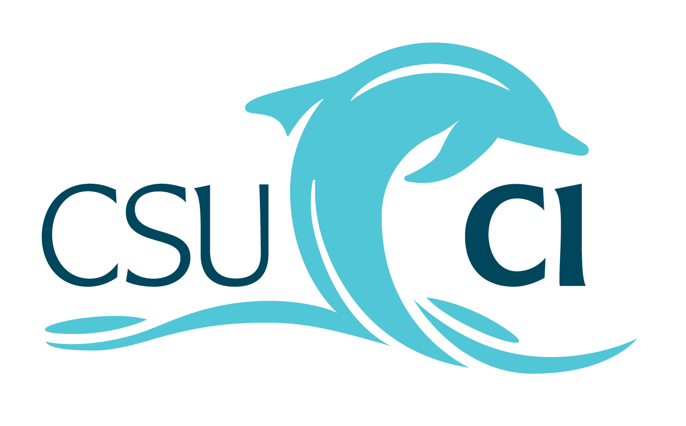

= COMP 469: Introduction To Artificial Intelligence
:doctype: book
:reproducible:
:source-highlighter: rouge
:rouge-style: github
:toc: left
:toclevels: 3
:sectnums:
:sectnumlevels: 2
:icons: font
:pdf-themesdir: themes
:pdf-theme: basic
:experimental:
:stem: latexmath
:description: Syllabus for COMP 469 Introduction To Artificial Intelligence at CSU Channel Islands - Fall 2026
:keywords: Artificial Intelligence, Neural Networks, Machine Learning, Data Mining, CSUCI, Syllabus

// =============================================================
// SP 24-07 COMPLIANCE NOTES (source comments; do not render)
//
// Element D: The Student Learning Outcomes below must match the
// SLOs in the APPROVED COURSE PROPOSAL / course outline of record,
// not instructor-authored outcomes. Obtain the COR from the
// Program Chair or Academic Programs and reconcile before
// distribution. This is the highest-risk item in a dean review.
//
// Element C: Catalog description is reproduced verbatim from the
// University Catalog. Do not edit it. Instructor elaboration
// belongs in "Topics Covered This Semester" below it.
//
// Search this file for "CONFIRM" to find every field that must be
// filled in before distribution.
// =============================================================

// Professional Header Branding
[.text-center]

[quote]
_The syllabus and course schedule are subject to change in the event of extenuating circumstances. Any changes will be announced in class and posted as an announcement in CI Learn, and a revised syllabus will be posted to the course site._

This syllabus is compliant with _Syllabus Policy SP 24-07_, a requirement for all courses on campus.

== Instructor Information

* *Instructor*: Juan Rios
* *Office Location*: Lindro Hall 2896
* *Office Hours*: Monday - Friday, 8:00-17:00, by appointment
* *Contact*: mailto:juan.rios381@csuci.edu[juan.rios381@csuci.edu]
* *Office Phone*: 805-437-3627

== Course Information

* *Course*: COMP 469 - Introduction To Artificial Intelligence
* *Units*: 3
* *Contact Hours*: Two hours lecture and three hours lab per week
* *Term*: Fall 2026
* *Modality*: In-person lecture (synchronous), online lab (asynchronous)
* *Lecture Meeting*: Tu 6:00PM - 8:00PM , Gateway Hall 3540
* *Lab Meeting*: Online
* *Final Exam*: Tuesday, December 8, 2026, 7:00 PM-9:00 PM, Gateway Hall 3540, in person.

=== Course Format

This is a hybrid class. Lecture meets synchronously in person on campus at the time listed above. The weekly lab is conducted asynchronously online; you complete lab work on your own schedule through CI Learn, subject to weekly deadlines.
The course combines lecture, guided demonstrations, hands-on programming labs, discussion, and project work.
In addition to attending class sessions, you need to log in to CI Learn 2-3 times a week to complete coursework and make sure you are up to date on what is due.

=== Course Description

The following description is reproduced from the University Catalog.

_Units: 3. Two hours lecture and three hours lab per week._

_Prerequisite(s): COMP 350 and COMP 362_

_A hands-on exploration of the use of computers to perform computations normally associated with intelligence, pattern formation and recognition using a variety of symbolic and sub-symbolic methods. Knowledge acquisition, representation, and maintenance will be covered._

_Graded: Letter Grade_

* *Prerequisites*: COMP 350 and COMP 362

==== Topics Covered This Semester

Within the catalog description above, this section of the course will address rational agents, state-space search, knowledge representation, logical inference, probability and uncertainty, data mining, decision trees, machine learning, pattern formation and recognition, neural networks, backpropagation, and computational models for intelligent behavior.
Additional topics include natural language processing, computer vision/imaging, reinforcement learning, responsible AI, and the limits of modern AI systems.

=== Course Requirements

* Regular access to a computer capable of running Python, Jupyter notebooks, and modern machine learning libraries
* Regular access to the Internet and CI Learn
* A CSUCI account for course communication and submissions
* A working programming environment with Python 3, Jupyter, NumPy, pandas, scikit-learn, and either PyTorch or TensorFlow, as directed by the instructor
* A willingness to read code, debug code, work with datasets, and explain model behavior in writing

A GPU is not required for this course. Labs and projects will be designed to run on ordinary student-accessible hardware or campus lab systems.

=== Course-Specific Requirements Outside Scheduled Class Time

This section is provided in accordance with SP 24-07 §I.H.

* *Financial commitments*: As of the date this syllabus was published, there are no course fees beyond standard CSUCI tuition and fees, and all software used in this course is free and open source. The reference textbook listed below is recommended, not required; required readings are provided through CI Learn at no additional cost. Any change to these arrangements will be announced in accordance with the syllabus change policy stated above.
* *Off-campus travel*: None is required.
* *Attendance outside scheduled course time*: One activity falls outside the regular class meeting pattern.
** The final examination is scheduled for Tuesday, December 8, 2026, 7:00-9:00 PM in Gateway Hall 3540, per the University Final Exam Schedule.
* *Equipment*: No purchase of specialized equipment is required. Campus lab systems are sufficient for all labs and projects.

=== Student Learning Outcomes

On completion of the course, students should be able to:

* Explain major approaches to artificial intelligence, including symbolic reasoning, probabilistic reasoning, machine learning, and neural networks.
* Formulate AI problems using agents, state spaces, actions, transition models, goal tests, and evaluation functions.
* Implement and compare uninformed and informed search algorithms, including breadth-first search, depth-first search, uniform-cost search, and A* search.
* Represent knowledge using logical rules or structured representations and apply basic inference techniques.
* Use probability to reason under uncertainty, including Bayes' theorem, naive Bayes classifiers, and Bayesian network concepts.
* Prepare datasets, train models, evaluate performance, and explain the tradeoffs among accuracy, generalization, interpretability, and computational cost.
* Implement or apply decision trees, clustering, linear classifiers, perceptrons, and multilayer neural networks.
* Explain the role of gradient descent and backpropagation in training neural networks.
* Apply AI techniques to small problems involving search, classification, text, images, or decision making.
* Analyze ethical, social, privacy, security, and fairness issues associated with AI systems.
* Communicate AI design decisions, experimental results, and limitations clearly in oral and written forms.

// COMPLIANCE: verify the list above against the approved course
// proposal (course outline of record) before distributing.

== Course Policies

=== AI Use Policy

This is an artificial intelligence course, so students will discuss, evaluate, and sometimes use AI tools as part of the learning process.
You are welcome to consult AI agents to ask questions about the course material, but you must use these tools in a way that helps you create your own solutions, rather than as a replacement for learning.

* You may use AI tools to ask conceptual questions, generate small examples, review error messages, help debug code, or compare possible approaches.
* You may not use AI tools to complete assignments, labs, projects, quizzes, or exams for you.
* You may not submit code, text, analysis, diagrams, or experimental results generated by an AI tool unless the assignment explicitly permits it and you clearly disclose how the tool was used.
* You may not use AI tools during exams or in-class assessments unless explicitly authorized by the instructor.
* For assignments where AI tool use is permitted, include a brief disclosure in your submission describing the tool used, the prompt or type of help requested, and what you changed or verified yourself.

You must understand your submitted work well enough to explain it without any assistance from an AI agent.
The instructor may ask students to explain code, results, or written responses as part of assessment.
Undisclosed use of AI tools where disclosure is required, or use of AI tools where they are prohibited, is treated as academic dishonesty under the Policy on Academic Integrity described below.

=== Late Work Policy

If you think there may be a problem that will interfere with submitting an assignment on time, it is expected you will communicate your concern with me well in advance (several days before) the due date.
Late assignments will only be accepted with prior permission from the instructor or at the instructor's discretion.
If you are absent from class, it is your responsibility to check CI Learn for announcements and assignments given while you were absent.

=== Course Communication Policy

Please contact me via your MyCI email account or through CI Learn if you have any questions about the material, the course, assignments, and so on.
Attachments and formatting work much better through email.
Your CSUCI email account is the official channel for course communication. You are responsible for messages sent to that address and to the CI Learn announcements feed. I will normally respond to email within one business day.

=== Recording and Taping Policy

Class sessions may not be audio recorded, video recorded, photographed, streamed, or otherwise captured without my prior written permission.
Students approved for recording as a reasonable accommodation through Disability Accommodations and Support Services (DASS) are exempt from this restriction.
Recordings authorized for accommodation purposes are for the individual student's personal academic use only and may not be shared, posted, or redistributed.
If I record a session, I will announce it in advance and post the recording to CI Learn for enrolled students only.

=== Devices in Class

Laptops are expected for lecture and in-class activities; labs are completed online on your own device.
Use devices for course-related work during class.
Phones should be silenced. If you need to take a call, step outside.
Device use unrelated to the course that disrupts others is addressed under the Civil Discourse statement below.

=== Extra Credit Policy

Extra credit is not offered on an individual basis.
If any extra credit opportunity is made available, it will be announced to the entire class through CI Learn and will be worth no more than 2% of the final grade.

=== Enrollment, Attendance in Week One, and Drops

Students who do not attend the first class meeting and who have not contacted me in advance may be dropped to make space for students on the waitlist.
Being dropped is not automatic, and it remains your responsibility to verify your enrollment status in myCI.
Withdrawal after the published deadlines requires a serious and compelling reason documented through the Registrar's Office.

=== Build Rapport

If you find that you have any trouble keeping up with assignments or other aspects of the course, make sure you let me know as early as possible.
As you will find, building rapport and effective relationships are key to becoming an effective professional.
Make sure that you are proactive in informing your instructors when difficulties arise during the semester so that they can help you find a solution.

=== Group Work Policy

Some labs and project milestones may involve pair or small-group work.
The lab grades may be split into individual contribution and group contribution when group work is assigned.
By default, each student will receive the same grade for the group contribution portion of a group lab or project milestone.
However, I reserve the right to modify individual grades based on unacceptable contribution.
I also reserve the right to modify team membership if necessary.

Students are responsible for understanding all code, results, and written analysis submitted under their name.

=== Grading Policy

Grades in this course are assigned in accordance with the CSUCI Policy on Grades (SP 12-007).
This course is graded on a letter-grade basis. Credit/No Credit grading is not available for this course.

.Letter Grade Assignment
[cols="1,1,2",options="header"]
|===
| Letter Grade | Percentage | Performance
| A   | 93-100% | Excellent Work
| A-  | 90-92%  | Nearly Excellent Work
| B+  | 87-89%  | Very Good Work
| B   | 83-86%  | Good Work
| B-  | 80-82%  | Mostly Good Work
| C+  | 77-79%  | Above Average Work
| C   | 73-76%  | Average Work
| C-  | 70-72%  | Mostly Average Work
| D+  | 67-69%  | Below Average Work
| D   | 63-66%  | Poor Work
| D-  | 60-62%  | Minimally Passing Work
| F   | 0-59%   | Failing Work
|===

*Rounding*: Final percentages are rounded to the nearest whole number. A 92.5% becomes 93%; a 92.4% remains 92%. No other rounding or curving is applied.

*Grade posting*: Running grades are maintained in the CI Learn gradebook. If you believe a grade is in error, contact me within one week of the grade being posted.

*Incomplete (I) grades*: An Incomplete may be assigned only when a student has completed the substantial majority of coursework at a passing level and is unable to finish the remainder for a serious and compelling reason beyond their control, consistent with SP 12-007. An Incomplete requires a written agreement specifying the work to be completed and the deadline. Incompletes are not a remedy for falling behind.

*Withdrawals*: Withdrawal deadlines and requirements are set by the Registrar's Office. Ceasing to attend does not constitute a withdrawal and will result in a grade of F.

=== Policy on Academic Integrity

By enrolling at CSU Channel Islands, students are responsible for upholding the University's policies and the Student Conduct Code.
Academic integrity and scholarship are values of the institution that ensure respect for the academic reputation of the University, students, faculty, and staff.
Cheating, plagiarism, unauthorized collaboration with another student, knowingly furnishing false information to the University, buying, selling or stealing any material for an examination, or substituting for another person may be considered violations of the link:http://www.csuci.edu/campuslife/student-conduct/academic-dishonesty.htm[Student Conduct Code].

*Application to course grades*: In this course, I will adhere to the general guidelines set forth in the Policy on Academic Integrity (SP 19-001).
I do not impose specialized or automatic grade consequences beyond those the policy provides.
Grade penalties will be determined case by case and may include a reduced or failing grade on the assignment or in the course.
A disciplinary referral will be submitted to the Dean of Students office in every substantiated case.
Please ask about my expectations regarding academic dishonesty in this course if they are unclear.

=== Attendance Policy

This policy is provided in accordance with the CSUCI Policy on Class Attendance (SP 01-056).

Students are expected to attend each lecture session; labs are completed asynchronously online by the posted deadlines.
Attendance and in-class activities account for 5% of the final grade, as shown in the assessment breakdown below.
Because labs are hands-on, falling behind on lab deadlines directly affects your ability to complete lab deliverables.

If you cannot attend a session, contact me prior to the meeting time to explain your circumstances.

*Excused absences*: Consistent with SP 01-056, absences for the following reasons will be excused and you will be given a reasonable opportunity to make up missed work without penalty, provided you notify me in advance where advance notice is possible.

* Participation in official University-sanctioned activities, including athletics and academic competitions
* Religious observance
* Documented illness, injury, or medical necessity
* Military service obligations
* Death or serious illness in the immediate family
* Other serious and compelling circumstances, at the instructor's discretion

For absences with extenuating circumstances related to a medical condition or disability for which you may require reasonable accommodation, please refer to the Disability Statement.

=== Curricular Elements

* Activities
** Short in-class activities will reinforce core concepts such as search traces, probability calculations, model evaluation, and neural network training behavior.
* Labs
** Labs are completed asynchronously online unless otherwise stated. Labs may include Python notebooks, short programming tasks, model analysis, and written reflections.
* Projects
** Several coding and analysis projects will be given throughout the semester. Projects will emphasize implementation, experimentation, model evaluation, and clear explanation of results.
* Exams
** A midterm and a final exam are given. Exams may include conceptual questions, algorithm tracing, short written responses, code reading, and practical analysis.
** The midterm is administered in person in the assigned lab and is completed on the lab computers.
** The final exam is administered in person in Gateway Hall 3540 at the time set by the University Final Exam Schedule. Because Gateway Hall 3540 is not a computer lab, the final exam is written rather than computer-based. Any change to this arrangement will be announced at least two weeks in advance.
** Students with approved DASS accommodations will be provided the accommodations on file for both exams.

==== Major Readings and Required Materials

As of the date this syllabus was published, required readings are provided through CI Learn and may include instructor notes, notebooks, textbook excerpts, and open educational resources.
The following reference is recommended, not required, for students who want a structured textbook treatment of the material. Any change to required readings or materials will be announced in accordance with the syllabus change policy stated above:

* *Reference Textbook:* _Artificial Intelligence: A Modern Approach_
** *Authors:* Stuart Russell and Peter Norvig
** *Edition:* 4th Edition
** *Publisher:* Pearson

==== Major Assignments and Assessments for Introduction To Artificial Intelligence

.Percentage Breakdown
[cols="1,1",options="header"]
|===
| Percentage | Assignment
| 5   | Attendance and in-class activities
| 20  | Labs
| 15  | Programming and analysis projects
| 30  | Midterm exam
| 30  | Final exam
| 100 | Total
|===

=== Tentative Course Schedule or Course Outline

*Note on Schedule:* This course follows a review-before-exam rhythm. The midterm review is held at the end of the Week 7 class meeting, and the midterm exam is given at the next class meeting in Week 8. Week 15 serves as a comprehensive final review.

*Note on Readings:* The primary reference is *Artificial Intelligence: A Modern Approach*, 4th Edition by Stuart Russell and Peter Norvig. We will cover selected chapters and sections. Full weekly reading assignments will be posted on CI Learn.

.Major Assessment Dates
[cols="2,2,2",options="header"]
|===
| Assessment | Date | Weight
| Midterm exam | Tuesday, October 13, 2026 | 30%
| Final exam | Tuesday, December 8, 2026, 7:00-9:00 PM, Gateway Hall 3540 | 30%
|===

[cols="1,1,2,3,3,3",options="header"]
|===
| Week | Dates | Core Concept | Key Topics and Reading Focus | Lab/Assignment Focus | Calendar Notes

| 1 | Aug 24-28 | AI Foundations | What is AI? Definitions, history, rational-agent perspective, benefits, and risks. 
*AIMA:* Ch. 1 (all) | Activity: AI definitions, examples, and course setup. | Classes begin Aug 24.

| 2 | Aug 31-Sep 4 | Intelligent Agents | Agents and environments, rationality, PEAS framework, environment properties, agent architectures. 
*AIMA:* Ch. 2 (all) | Lab: Vacuum/Gridworld agents. | Normal week.

| 3 | Sep 7-11 | State-Space Search | Problem formulation, uninformed search. 
*AIMA:* Ch. 3 (3.1-3.5) | Lab: Implement BFS, DFS, UCS. | Labor Day (Sep 7); campus closed.

| 4 | Sep 14-18 | Informed & Adversarial Search | Heuristics, A*, minimax, alpha-beta. 
*AIMA:* Ch. 3 (3.6) + Ch. 5 (5.1-5.3) | Lab: A* + minimax. | Normal week.

| 5 | Sep 21-25 | Propositional Logic | Knowledge-based agents, propositional logic & inference. 
*AIMA:* Ch. 7 (7.1 Knowledge-Based Agents; 7.2 The Wumpus World; 7.3 Logic; 7.4 Propositional Logic; selected 7.5 Propositional Theorem Proving, especially 7.5.1, 7.5.3, 7.5.4). Optional enrichment: 7.6-7.7. | Lab: Wumpus World. | Normal week.

| 6 | Sep 28-Oct 2 | First-Order Logic | FOL syntax, semantics, and usage. 
*AIMA:* Ch. 8 (8.1, 8.2, 8.3) | Lab: Family knowledge base. | Normal week.

| 7 | Oct 5-9 | Quantifying Uncertainty | Probability, independence, Bayes' rule, and naive Bayes. 
*AIMA:* Ch. 12 (12.1 Acting under Uncertainty; 12.2 Basic Probability Notation; selected 12.3 Inference Using Full Joint Distributions; 12.4 Independence; 12.5 Bayes' Rule and Its Use; 12.6 Naive Bayes Models). Optional enrichment: 12.7 The Wumpus World Revisited. | Lab: Probability + Naive Bayes classifier. | *Midterm Review*: Tuesday, October 6, 2026, held at the end of class.

| 8 | Oct 12-16 | Midterm Exam | Comprehensive review of agents, search, games, logic, first-order logic, and uncertainty.
*AIMA:* Review Ch. 1-3, Ch. 5, Ch. 7, Ch. 8, and Ch. 12 selected readings. | *Midterm Exam*: Tuesday, October 13, 2026. | Midterm exam week.

| 9 | Oct 19-23 | Bayesian Networks | Bayesian networks, graphical models, conditional independence. 
*AIMA:* Ch. 13 (13.1 Representing Knowledge in an Uncertain Domain; 13.2 The Semantics of Bayesian Networks, especially 13.2.1 Conditional Independence and 13.2.2 Efficient Representation of Conditional Distributions; selected 13.3 Exact Inference in Bayesian Networks, especially 13.3.1 Inference by Enumeration and 13.3.2 Variable Elimination). Optional enrichment: 13.4 Approximate Inference and 13.5 Causal Networks. | Lab: Bayesian networks. | Normal week.

| 10 | Oct 26-30 | Machine Learning Foundations | Decision trees, supervised learning, perceptron, linear/logistic models, and model evaluation. 
*AIMA:* Ch. 19 (19.1 Forms of Learning; 19.2 Supervised Learning; 19.3 Learning Decision Trees; 19.4 Model Selection and Optimization; 19.6 Linear Regression and Classification; selected 19.9 Developing Machine Learning Systems). | Lab: Decision trees, perceptron, and logistic regression. | Normal week.

| 11 | Nov 2-6 | Neural Networks | Feedforward networks, activations, XOR, backpropagation, optimization basics. 
*AIMA:* Ch. 21 (21.1-21.6 selected) | Lab: Simple MLP training. | Normal week.

| 12 | Nov 9-13 | Making Complex Decisions | Sequential decision problems, utilities over time, Markov decision processes, value iteration, and policy iteration. 
*AIMA:* Ch. 17 (17.1 Sequential Decision Problems; 17.2 Algorithms for MDPs, through 17.2.2 Policy iteration). Optional enrichment: 17.4 Partially Observable MDPs. | Lab: Value iteration on Gridworld. | Veterans Day (Nov 11); campus closed. Adjust deadlines.

| 13 | Nov 16-20 | AI Applications: NLP and Computer Vision | Language models, text classification, image classification, and modern AI applications. 
*AIMA:* Ch. 23 (23.1 Language Models; 23.5 Complications of Real Natural Language; 23.6 Natural Language Tasks) + Ch. 25 (25.1 Introduction; 25.4 Classifying Images, especially 25.4.1-25.4.2). | Lab: Text or image classification mini-lab. | Normal week.

| 14 | Nov 23-27 | Reinforcement Learning | From MDPs to learning from experience; passive RL, active RL, exploration, and Q-learning on Gridworld. 
*AIMA:* Ch. 22 (22.1 Learning from Rewards; 22.2 Passive Reinforcement Learning; 22.3 Active Reinforcement Learning; selected 22.4 Generalization in Reinforcement Learning). | Lab: Q-learning. | Thanksgiving holiday (Nov 26-27); campus closed.

| 15 | Nov 30-Dec 5 | Responsible AI, Synthesis & Final Review | Philosophy, ethics, and safety of AI + course synthesis + final review. 
*AIMA:* Ch. 1.5 + *Ch. 27 (all)* | Final Review Session. | Last day of instruction Dec 5.

| 16 | Dec 7-12 | Final Examination Period | Final Exam. | *Final Exam:* Tuesday, December 8, 2026, 7:00-9:00 PM, Gateway Hall 3540. | Final exam week.
|===

==== Additional Lab Resources

* https://github.com/aimacode/aima-python
* Geron _Hands-On Machine Learning_ GitHub notebooks

=== Student Support Services

CSUCI's link:http://go.csuci.edu/syllabuspolicies[Syllabus Policies and Assistance Website] (go.csuci.edu/syllabuspolicies) provides important details about academic policies, campus expectations, and student support services that are all highly applicable to your success as a student both in and outside of the classroom.
Ensure that you review this site on a regular basis to stay informed about the policies and resources that support your success, as campus resources or policies may change semester to semester.

==== Disability Statement

If you are a student with a disability requesting reasonable accommodations in this course, please contact the student disability accommodations office.
All requests for reasonable accommodations require registration with the accommodations office in advance of needed services.
Faculty, students, and the accommodations office will work together regarding academic accommodations.
Students are encouraged to discuss approved accommodations with your faculty.

Please visit Disability Accommodations and Support Services (DASS) located on the second floor of Arroyo Hall or call 805-437-3331.
All requests for reasonable accommodations require registration with DASS in advance of need.
You can link:https://www.csuci.edu/dass/students/apply-for-services.htm[apply for DASS services online].

==== Basic Needs and Emergency Intervention

Please use the link to the link:https://www.csuci.edu/basicneeds/[Basic Needs Program] on the link:http://go.csuci.edu/syllabuspolicies[Syllabus Policies and Assistance] website (go.csuci.edu/syllabuspolicies) for information on emergency food, housing accommodations, toiletries, and connections to critical resources.

== Additional Elements

=== Campus Tutoring Services - Learning Resource Center (LRC)

CSUCI has many free services to help you achieve your academic goals.
You are encouraged to make early and regular use of the tutoring centers located in Broome Library, which offer free in-person and online tutoring support and academic success workshops.
Many courses also have Embedded Peer Educators who lead regular study groups and exam review sessions.
Working with a tutor is a great way to develop your learning habits, get clarification on an assignment, study for an exam, or get feedback on a paper or project.

For writing assignments, communication-based projects, and multiliteracy development, please visit the link:https://www.csuci.edu/wmc/[Writing and Multiliteracy Center].
For subject-specific tutoring across many courses and disciplines, please visit the link:https://www.csuci.edu/learningresourcecenter/[Learning Resource Center].

=== CI Mission Statement

Placing students at the center of the educational experience, California State University Channel Islands provides undergraduate and graduate education that facilitates learning within and across disciplines through integrative approaches, emphasizes experiential and service learning, and graduates students with multicultural and international perspectives.

=== Civil Discourse Statement

All students, staff and faculty on our campus are expected to join in making our campus a safe space for communication and civil discourse.
If you are experiencing discomfort related to the language you are hearing or seeing on campus (in or out of classes), please talk with a trusted faculty or staff member.
Similarly, please consider whether the language that you are using (in person or on CI Learn) respects the rights of others to "engage in informed discourse and express a diversity of opinions freely and in a civil manner"
(language from link:https://senate.csuci.edu/resolutions/2016-2017/sr-16-01-resolution-on-commitment-to-equity-inclusion-civil-discourse-at-ci.pdf[SR 16-01, Commitment to Equity, Inclusion, and Civil Discourse within our Diverse Campus Community]).

In addition, students whose conduct adversely affects the learning environment in this classroom may be subject to disciplinary action.
Students that disrupt this course may receive a verbal and written warning from the instructor, they may be excused from the class for the day, they may be excused from the class for up to one class period, and/or they may be referred to the Dean of Students office for further review and possible disciplinary action.

=== Counseling and Psychological Services (CAPS)

Counseling and Psychological Services (CAPS) provides a wide range of confidential services to assist students in achieving their academic and personal goals and well-being.
Services include confidential short-term counseling, crisis intervention, group therapy, and assistance with community referrals for a wide range of mental health concerns.
Students can also meet with trained Mental Health Peers for support regarding school-related anxiety.

CAPS is located in Bell Tower East Room 1867.
Appointments are available in person and via telehealth.
Appointments can be scheduled by calling 805-437-2088, by email at mailto:caps@csuci.edu[caps@csuci.edu], or walking into the clinic.
For more information, visit the link:https://www.csuci.edu/caps[CAPS website].
Crisis phone support is available 24/7 by calling 855-854-1747 and by calling or texting 988.

=== Names and Pronouns Statement

I will gladly honor your request to address you by a name or pronoun that is not on the roster or in CI Learn.
Please advise me early in the semester so that I may make appropriate changes to my records.
You may also update this information in the myCI Student Center.
For more information, visit the link:https://www.csuci.edu/registrar/personal-info-update.htm[Preferred Names and Pronouns webpage].

=== Title IX and Inclusion

Title IX & Inclusion manages the University's equal opportunity compliance, including the areas of affirmative action and Title IX.
Title IX & Inclusion also oversees the campus' response to the University's nondiscrimination policies.

CSU Channel Islands prohibits discrimination and harassment of any kind on the basis of a protected status (i.e., age, disability, gender, genetic information, gender identity, gender expression, marital status, medical condition, nationality, race or ethnicity, religion or religious creed, sexual orientation, and Veteran or Military Status).
This prohibition on harassment includes sexual harassment, as well as sexual misconduct, dating and domestic violence, and stalking.

For more information regarding CSU Channel Islands' commitment to diversity and inclusion or to report a potential violation, please contact Title IX & Inclusion at 805.437.2077 or visit the link:https://www.csuci.edu/titleix[Title IX & Inclusion website].