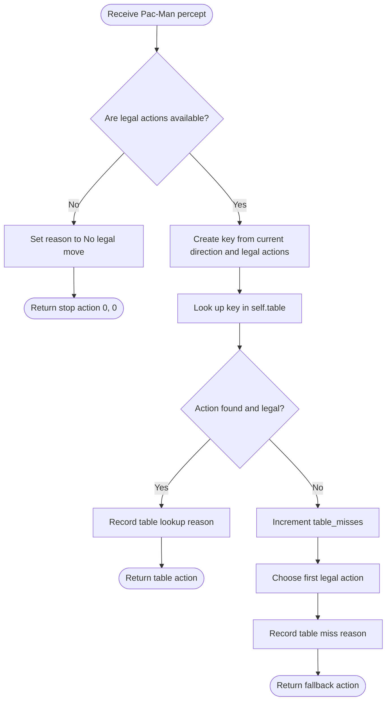

# AIMA Table-Driven Agent — Pac-Man Example

## Overview

This Pac-Man agent demonstrates the table-driven design discussed in **AIMA 4e, Section 2.4**. The complete lookup table is created once in `__init__`. When Pac-Man needs to move, `choose_action` converts the current percept into a key and retrieves the action stored under that key.

The agent does not evaluate condition–action rules or calculate a new plan at runtime. Its normal behavior is already encoded in `self.table`.

> [!note] Relationship to the AIMA pseudocode
> AIMA's general `TABLE-DRIVEN-AGENT` uses the complete percept history as its lookup key. This project uses only the current percept: `(current_direction, legal_actions)`. It therefore illustrates the table-driven concept without storing previous percepts.

## Pac-Man percept

The percept is deliberately limited to two fields:

| Field               | Meaning                                                |
| ------------------- | ------------------------------------------------------ |
| `current_direction` | The direction Pac-Man is currently traveling           |
| `legal_actions`     | All movement directions currently available to Pac-Man |

## Building the lookup table

`_build_table()` generates an entry for every current direction and every nonempty subset of possible legal actions. Each entry follows this policy:

1. If Pac-Man's current direction is still legal, keep moving in that direction.
2. Otherwise, take the first available legal action.

```text
(current_direction, legal_actions) → selected action
```

For example:

| Current direction | Legal actions | Stored action | Explanation                                         |
| ----------------- | ------------- | ------------- | --------------------------------------------------- |
| Right             | Right, Up     | Right         | Continue in the current direction                   |
| Left              | Up, Right     | Up            | Left is unavailable, so take the first legal action |
| Stop `(0, 0)`     | Down, Left    | Down          | Stop is unavailable, so take the first legal action |

## `choose_action` logic



## Equivalent pseudocode

```text
function CHOOSE-ACTION(percept):
    if legal_actions is empty:
        return STOP

    key ← (current_direction, legal_actions)
    action ← LOOKUP(key, table)

    if action is missing or action is illegal:
        increment table_misses
        action ← first legal action

    return action
```

## Why the design does not scale

Adding `pellets` or `ghosts` to the percept would be legal, but the table would need a separate entry for every distinct value those fields could have. If a maze begins with $n$ pellets, the remaining-pellet configuration alone can take:

$$
2^n
$$

different values because each subset of pellets represents a distinct situation. Ghost positions and other environmental details would multiply the number of required entries again.

This is the main AIMA lesson demonstrated by the agent: exhaustive lookup tables become impractically large as percepts become more informative. The other agents in the project avoid this problem by computing actions at runtime rather than storing an action for every possible situation.

## Code responsibilities

| Component | Responsibility |
|---|---|
| `Percept` | Stores the current direction and legal actions |
| `_all_nonempty_subsets()` | Generates every possible nonempty legal-action tuple |
| `_build_table()` | Precomputes the percept-to-action lookup table |
| `choose_action()` | Looks up an action and handles no-move or table-miss cases |
| `table_misses` | Counts lookup failures or invalid table results |
| `last_reason` | Records why the most recent action was selected |
