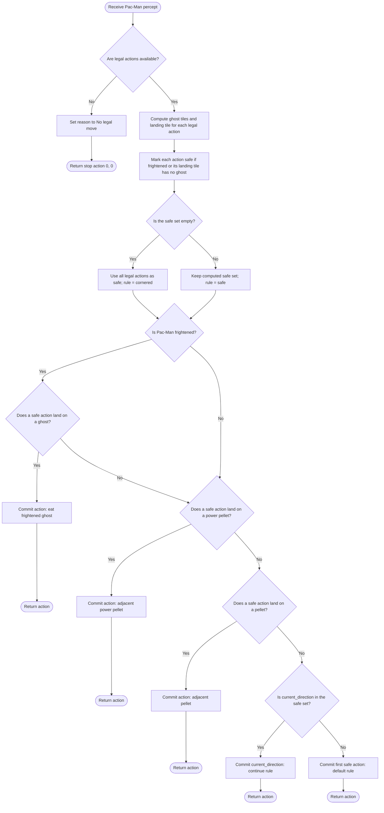

# AIMA Simple Reflex Agent — Pac-Man Example

## Overview

This Pac-Man agent demonstrates the simple reflex design discussed in **AIMA 4e, Figure 2.10**. On every call, `choose_action` applies a short, ORDERED list of condition-action rules to the CURRENT percept only, and returns as soon as the first matching rule fires.

The agent keeps no internal state between calls. It cannot distinguish "I already cleared this corridor" from "this corridor was always empty" — every decision is made fresh from what is visible right now.

> [!note] Relationship to AIMA Figure 2.10
> AIMA's simple reflex agent structure is: interpret the current percept, match it against condition-action rules, and execute the action of the first rule that fires. This agent follows that structure exactly — five rules, checked in a fixed priority order inside `choose_action`, no memory of earlier percepts.

> [!warning] Why this design fails
> Because there is no state, once the agent clears the easy pellets near its current position it has no way to know it should look elsewhere — it will pace back and forth in what is now an empty area, repeatedly re-deriving "keep going straight" or "take the first safe action" from an unchanging percept. This exact failure mode is why AIMA moves on to model-based reflex agents next (Part 3): a model-based agent adds internal state so the agent can remember what it has already done.

## Pac-Man percept

| Field | Meaning |
|---|---|
| `player` | Pac-Man's current tile |
| `current_direction` | The direction Pac-Man is currently traveling |
| `pellets` | Set of tiles that still contain a regular pellet |
| `power_pellets` | Set of tiles that still contain a power pellet |
| `released_ghosts` | Tiles currently occupied by ghosts that are out and active |
| `legal_actions` | All movement directions currently available to Pac-Man |
| `frightened_time_remaining` | Seconds left in which ghosts are edible |
| `frightened` *(computed property)* | `True` whenever `frightened_time_remaining > 0.0` |

## The five rules, in priority order

`choose_action` checks these conditions in order and commits to the first one that matches. Because it returns immediately on a match, a lower-numbered rule always wins over a higher-numbered one.

| # | Rule | Condition | Action if matched |
|---|---|---|---|
| 1 | Avoid danger | Build the **safe** set: every legal action that either (a) Pac-Man is frightened, or (b) does not land on a ghost's tile. If no action is safe (every direction leads to a ghost), fall back to treating all legal actions as safe — this is the "cornered" case. | Not a returning rule by itself — it defines which actions rules 2–5 are allowed to choose from. |
| 2 | Eat a frightened ghost | Pac-Man is frightened **and** a safe action lands on a ghost's tile | Take that action — reason: `eat frightened ghost` |
| 3a | Take a power pellet | A safe action lands on a tile in `power_pellets` | Take that action — reason: `adjacent power pellet` |
| 3b | Take a pellet | No power pellet found, but a safe action lands on a tile in `pellets` | Take that action — reason: `adjacent pellet` |
| 4 | Keep going straight | No pellet or power pellet found, but `current_direction` is still in the safe set | Take `current_direction` — reason: `continue (safe)` or `continue (cornered)` |
| 5 | Default | Nothing else matched | Take the first safe action — reason: `default (safe)` or `default (cornered)` |

The `(safe)` / `(cornered)` suffix on rules 4 and 5 simply reports which branch of rule 1 produced the safe set being used.

## Example scenarios

| Scenario | Frightened? | Ghost nearby | Power pellet nearby | Pellet nearby | Current direction still safe | Rule that fires |
|---|---|---|---|---|---|---|
| Ghost is adjacent and edible | Yes | Yes | – | – | – | Rule 2: eat frightened ghost |
| Ghost blocks one direction, but another safe direction has a power pellet | No | Yes (blocks one option) | Yes (via a safe direction) | – | – | Rule 3a: adjacent power pellet |
| Nothing dangerous or edible nearby, current heading still open | No | No | No | No | Yes | Rule 4: continue (safe) |
| Every direction leads to a ghost, but current heading is still legal | No | Yes (all directions) | No | No | Yes | Rule 4: continue (cornered) |
| Every direction leads to a ghost, and current heading is no longer legal | No | Yes (all directions) | No | No | No | Rule 5: default (cornered) |

## `choose_action` logic



## Equivalent pseudocode

```text
function CHOOSE-ACTION(percept):
    if legal_actions is empty:
        return STOP

    ghosts ← tiles of released ghosts
    landing[a] ← MAZE-STEP(player, a)   for each a in legal_actions

    safe ← [a in legal_actions where frightened or landing[a] not in ghosts]
    if safe is empty:
        safe ← legal_actions            // cornered: every direction is dangerous
        rule ← "cornered"
    else:
        rule ← "safe"

    if frightened:
        for a in safe:
            if landing[a] in ghosts:
                return a                 // eat frightened ghost

    for a in safe:
        if landing[a] in power_pellets:
            return a                     // adjacent power pellet

    for a in safe:
        if landing[a] in pellets:
            return a                     // adjacent pellet

    if current_direction in safe:
        return current_direction         // continue (rule)

    return safe[0]                       // default (rule)
```

## Code responsibilities

| Component | Responsibility |
|---|---|
| `Percept` | Stores the full world snapshot: player tile, heading, pellets, power pellets, ghosts, legal actions, and frightened timer |
| `Percept.frightened` | Derives a boolean from `frightened_time_remaining` so the rules don't compare a float directly |
| `choose_action()` | Applies the five ordered rules to the current percept and returns as soon as one fires |
| `landing` (local dict) | Maps each legal action to the tile Pac-Man would occupy after taking it, computed fresh every call |
| `safe` (local list) | The subset of legal actions rules 2–5 are allowed to pick from |
| `_commit()` | Records `last_reason` (direction name plus which rule fired) and returns the chosen action |
| `last_reason` | Human-readable record of why the most recent action was selected |
