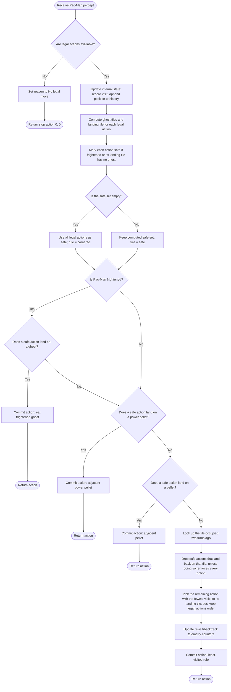

# AIMA Model-Based Reflex Agent — Pac-Man Example

## Overview

This Pac-Man agent demonstrates the model-based reflex design discussed in **AIMA 4e, Figures 2.11 / 2.12**. It adds exactly one thing on top of the Part 2 simple reflex agent: **internal state**, updated every turn from the percept sequence, that lets the agent tell "I have already cleared this tile" apart from "this tile just happens to be empty."

> [!important] Still a reflex agent
> Action selection is still a short list of condition-action rules — not a scored search over alternatives (that upgrade is Part 5, the utility-based agent). The new rules here just get to consult memory as one more condition. Nothing here plans ahead or evaluates outcomes; it reacts to (percept + memory), the same way Part 2 reacted to (percept) alone.

## Pac-Man percept

Identical to Part 2 — the percept itself carries no memory. Memory lives entirely in the agent object, not the percept.

| Field | Meaning |
|---|---|
| `player` | Pac-Man's current tile |
| `current_direction` | The direction Pac-Man is currently traveling |
| `pellets` | Set of tiles that still contain a regular pellet |
| `power_pellets` | Set of tiles that still contain a power pellet |
| `released_ghosts` | Tiles currently occupied by ghosts that are out and active |
| `legal_actions` | All movement directions currently available to Pac-Man |
| `frightened_time_remaining` | Seconds left in which ghosts are edible |
| `frightened` *(computed property)* | `True` whenever `frightened_time_remaining > 0.0` |

## Internal state (new in Part 3)

| Field | Type | What it tracks |
|---|---|---|
| `visit_counts` | `dict[tile, int]` | How many times Pac-Man has occupied each tile, including the current one |
| `position_history` | `deque[tile]`, `maxlen=4` | The last up to four tiles occupied, oldest first, most recent last. Only the two most recent entries are read by the current rule — the extra headroom just leaves room to look further back without changing the data structure |
| `revisit_decisions` | `int` | Telemetry only: incremented whenever the tile finally chosen has been visited before. Does not affect the decision itself |
| `backtrack_decisions` | `int` | Telemetry only: incremented whenever the agent was forced to reverse anyway because no non-reversing safe option existed. Does not affect the decision itself |

`update_internal_state(percept)` folds the *current* percept into this state — it records `percept.player` into `visit_counts` and appends it to `position_history`. It runs once per turn, **but only when there is a legal move**: if `legal_actions` is empty, `choose_action` returns early and memory is not updated for that turn.

> [!note] Reading `two_ago` correctly
> `position_history[-2]` is computed *after* the current position has just been appended, so `[-1]` is "where I am right now" and `[-2]` is "where I was last turn." But the rule uses `two_ago` to filter the *landing* tile of a candidate action — i.e., where Pac-Man would be *next* turn. Counted from that future position, `[-1]` (where it is now) is one step back and `[-2]` is two steps back. That's the "two turns ago" in the docstring: it stops the classic ping-pong of stepping forward and then immediately reversing on the very next turn.

## What's new since Part 2

Part 3 keeps three of Part 2's five rules unchanged — ghost avoidance (with the same "cornered" fallback), eating an adjacent frightened ghost, and taking an adjacent power pellet or pellet. It **drops** Part 2's last two rules (continue straight if still safe; otherwise take the first safe action) and replaces them with a pair of memory-based rules:

| # | Rule | Condition | Result |
|---|---|---|---|
| 1 | Avoid danger | Build the **safe** set: legal actions where either Pac-Man is frightened, or the landing tile has no ghost. If nothing is safe, fall back to all legal actions — the "cornered" case. | Defines what rules 2–5 may choose from |
| 2 | Eat a frightened ghost | Frightened **and** a safe action lands on a ghost | Take it — reason: `eat frightened ghost` |
| 3a | Take a power pellet | A safe action lands on a tile in `power_pellets` | Take it — reason: `adjacent power pellet` |
| 3b | Take a pellet | No power pellet found, but a safe action lands on a tile in `pellets` | Take it — reason: `adjacent pellet` |
| 4 *(new)* | Don't reverse | Drop any safe action whose landing tile equals `two_ago` — **unless that would remove every option**, in which case reversing is allowed after all | Narrows the safe set to `non_backtrack` |
| 5 *(new)* | Prefer the road less traveled | Among what's left in `non_backtrack`, pick the action whose landing tile has the lowest `visit_counts` (ties keep `legal_actions` order) | Take it — reason: `least-visited (safe)` or `least-visited (cornered)` |

Rule 4 always runs before rule 5: a reversing move is removed from consideration first, and only *then* does the agent compare visit counts among what's left. A less-visited tile that requires reversing does **not** win over a more-visited tile that doesn't — reversing is only chosen when it is the sole remaining safe option.

## Example scenarios

| Scenario | What happens |
|---|---|
| Ghost adjacent and edible (frightened) | Rule 2 fires immediately, same as Part 2 — memory is never consulted |
| Two safe options: one reverses to the two-turns-ago tile (never visited), the other doesn't reverse but has been visited 3 times | Rule 4 removes the reversing option first; rule 5 then has only the visited option left, so the agent revisits it rather than reverse |
| Dead-end corridor: the only safe option reverses to the two-turns-ago tile | Rule 4's filter would empty `non_backtrack`, so it falls back to `safe` — the agent reverses, and `backtrack_decisions` increments |
| Two safe, non-reversing options with different visit counts, no pellets adjacent | Rule 5 picks the one with the lower `visit_counts` value; equal counts break by `legal_actions` order |
| Fresh corridor, nothing visited yet, no pellets adjacent | All visit counts are 0 (a tie), so the first non-reversing option in `legal_actions` order is chosen |

## `choose_action` logic



## Equivalent pseudocode

```text
function CHOOSE-ACTION(percept):
    if legal_actions is empty:
        return STOP

    UPDATE-STATE(percept)              // record visit, append position to history

    ghosts ← tiles of released ghosts
    landing[a] ← MAZE-STEP(player, a)  for each a in legal_actions

    safe ← [a in legal_actions where frightened or landing[a] not in ghosts]
    if safe is empty:
        safe ← legal_actions           // cornered: every direction is dangerous
        rule ← "cornered"
    else:
        rule ← "safe"

    if frightened:
        for a in safe:
            if landing[a] in ghosts:
                return a                // eat frightened ghost

    for a in safe:
        if landing[a] in power_pellets:
            return a                    // adjacent power pellet

    for a in safe:
        if landing[a] in pellets:
            return a                    // adjacent pellet

    two_ago ← position_history[-2] if history has >= 2 entries else NONE
    non_backtrack ← [a in safe where landing[a] != two_ago]
    if non_backtrack is empty:
        non_backtrack ← safe            // reversing is the only option left

    best ← argmin over non_backtrack of visit_counts[landing[a]]
                                         // ties broken by legal_actions order

    return best                         // least-visited (rule)
```

## Code responsibilities

| Component | Responsibility |
|---|---|
| `Percept` | Same world snapshot as Part 2 — carries no memory of its own |
| `visit_counts`, `position_history` | The agent's internal state: what it remembers between calls |
| `update_internal_state()` | Folds the current percept into memory; runs once per turn, only when a legal move exists |
| `choose_action()` | Runs rules 1–3 unchanged from Part 2, then the two memory-based rules (no-backtrack filter, least-visited pick) in place of Part 2's final two rules |
| `landing` / `safe` (local) | Same role as in Part 2: candidate landing tiles, and the subset that's safe to consider |
| `two_ago` / `non_backtrack` (local) | The anti-oscillation filter built from `position_history` |
| `revisit_decisions`, `backtrack_decisions` | Telemetry counters for analysis/write-up — they observe the decision, they don't influence it |
| `_commit()` | Records `last_reason` (direction name plus which rule fired) and returns the chosen action |
| `last_reason` | Human-readable record of why the most recent action was selected |
