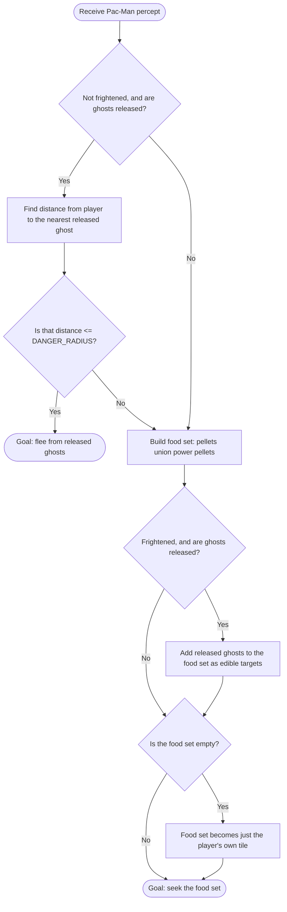
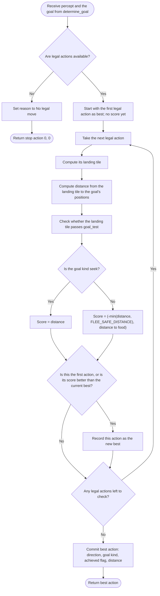

# AIMA Goal-Based Agent — Pac-Man Example

## Overview

This Pac-Man agent demonstrates the goal-based design discussed in **AIMA 4e, Figure 2.13**. The structural addition over Parts 1–3 is an explicit **goal** and a **goal test** — not a graded preference over many factors (that's Part 5, utility-based). The agent maintains exactly one goal at a time, either `"seek"` food or `"flee"` from ghosts, and for every legal action asks "does the resulting state get closer to satisfying this goal?" using the same `self.maze.distance` oracle every other part uses.

> [!important] Still not utility-based
> There is no numeric weighing of competing desires here. A state either satisfies the goal (`goal_test` returns `True`) or it doesn't; short of that, closer is strictly better and farther is strictly worse. Nothing here is scored on a blended scale that trades pellets off against risk — that blending is exactly what Part 5 adds.

> [!note] No memory needed
> Unlike Part 3, this agent doesn't track state between calls — the goal is recomputed fresh from each percept, so `Percept` here drops `current_direction` entirely (it's not read anywhere) and the agent has no `visit_counts` or history.

## Pac-Man percept

| Field | Meaning |
|---|---|
| `player` | Pac-Man's current tile |
| `pellets` | Set of tiles that still contain a regular pellet |
| `power_pellets` | Set of tiles that still contain a power pellet |
| `released_ghosts` | Tiles currently occupied by ghosts that are out and active |
| `legal_actions` | All movement directions currently available to Pac-Man |
| `frightened_time_remaining` | Seconds left in which ghosts are edible |
| `frightened` *(computed property)* | `True` whenever `frightened_time_remaining > 0.0` |

## Tunable constants

| Constant | Value | Meaning |
|---|---|---|
| `DANGER_RADIUS` | `2` | If the nearest ghost is this many steps away or closer (and Pac-Man isn't frightened), survival becomes the active goal instead of eating. Also the threshold the flee goal test uses: a position satisfies "flee" once it's **more than** `DANGER_RADIUS` steps from every ghost. |
| `FLEE_SAFE_DISTANCE` | `3` | While fleeing, the scoring stops rewarding extra distance once a landing tile is this many steps from every ghost. Without the cap, maximizing raw distance keeps pulling the agent into whichever pocket is farthest by corridor length — often a dead end — long after it's already safe. |

Notice `FLEE_SAFE_DISTANCE` is exactly `DANGER_RADIUS + 1`. That's not a coincidence: the flee goal is *achieved* the moment distance exceeds `DANGER_RADIUS` (i.e. reaches 3+), which is exactly the point where the scoring cap stops giving credit for going further. The two constants describe the same line in two different mechanisms — a boolean test and a capped score.

## Determining the goal



Two things worth calling out:

- **Flee outranks seek.** Danger is checked first; the agent only ever considers eating once it has decided it isn't in danger.
- **Frightened ghosts count as food.** When frightened, the released ghosts are folded into the same set as pellets and power pellets — the agent will path toward an edible ghost exactly like it would a power pellet, using the same "seek" machinery.
- The `{player}` fallback exists only so `maze.distance` never gets called against an empty set — it isn't meaningful behavior, just a guard against a crash on an empty maze.

## The goal test

```python
def goal_test(self, position, goal):
    kind, positions = goal
    if kind == "seek":
        return position in positions
    return self.maze.distance(position, positions) > self.DANGER_RADIUS
```

| Goal kind | Test |
|---|---|
| `seek` | Is `position` literally one of the target tiles (a pellet, power pellet, or — while frightened — a ghost)? |
| `flee` | Is `position` **strictly more than** `DANGER_RADIUS` steps from every ghost in the goal's position set? |

## Choosing an action

Unlike the rule lists in Parts 1–3, this loop doesn't stop at the first match — it evaluates **every** legal action and keeps the one with the best score.



### Reading the scores

- **`seek`**: the score is just the plain distance from the landing tile to the nearest target. Lower wins — this is a straightforward "get as close as possible" comparison.
- **`flee`**: the score is a *tuple*, compared lexicographically — first by `-min(distance, FLEE_SAFE_DISTANCE)`, then by distance to food:
  - Minimizing a negative capped distance is the same as maximizing the capped distance — so among options that are all still "somewhat dangerous" (below the cap), the farther one from the ghosts wins.
  - Once two options are both at or beyond `FLEE_SAFE_DISTANCE`, the first part of the tuple ties (both capped at `-3`), and the tie is broken by the *second* element: distance to food. So once safety is secured, the agent starts steering back toward pellets instead of maximizing distance further.
  - Note the `food` set used for this tie-break is `pellets ∪ power_pellets` only — it never includes ghosts, even if `frightened` were somehow true (which can't happen while `kind == "flee"`, since flee is only ever chosen when `not percept.frightened`).

The reason string logged at the end always reports the *actual* (uncapped) distance, even for a flee decision — the cap only affects how options are compared, not what gets reported.

> [!note] Safety isn't a separate rule here
> Parts 2 and 3 built an explicit `safe` list and filtered out ghost tiles before doing anything else. This agent has no such filter. Instead, safety falls out of the goal machinery: flee only activates once a ghost is within `DANGER_RADIUS`, and while it's active, landing on a ghost tile scores as distance `0` — the worst possible score — so it loses to any alternative automatically. If every legal action is equally bad (a true dead end), the loop still returns *something* rather than crashing; there's no separate "cornered" branch like Parts 2–3 had.

## Example scenarios

| Scenario | Goal chosen | What happens |
|---|---|---|
| No ghosts released yet | `seek` (flee's guard requires `released_ghosts` to be non-empty) | Heads for the nearest pellet or power pellet |
| Ghost released, not frightened, nearest ghost 1 step away | `flee` | Picks the legal action whose landing tile is farthest from the ghost (capped at 3), breaking ties by moving toward food |
| Ghost released, not frightened, nearest ghost 5 steps away | `seek` | The ghost is outside `DANGER_RADIUS`, so it's ignored entirely this turn |
| Frightened, ghost released | `seek` (ghosts added to food) | May head straight for the now-edible ghost if it's the nearest target |
| No pellets or power pellets anywhere, not fleeing | `seek` `{player}` fallback | All landing tiles score similarly since there's nothing real to seek — this is a crash guard, not meaningful strategy |

## Equivalent pseudocode

```text
function DETERMINE-GOAL(percept):
    if not percept.frightened and percept.released_ghosts:
        nearest ← DISTANCE(percept.player, percept.released_ghosts)
        if nearest <= DANGER_RADIUS:
            return ("flee", released_ghosts)

    food ← pellets ∪ power_pellets
    if percept.frightened and percept.released_ghosts:
        food ← food ∪ released_ghosts
    if food is empty:
        food ← {percept.player}
    return ("seek", food)

function GOAL-TEST(position, goal):
    (kind, positions) ← goal
    if kind = "seek":
        return position ∈ positions
    return DISTANCE(position, positions) > DANGER_RADIUS

function CHOOSE-ACTION(percept):
    if legal_actions is empty:
        return STOP

    goal ← DETERMINE-GOAL(percept)
    (kind, positions) ← goal
    food ← pellets ∪ power_pellets          // flee's tie-breaker only

    best ← legal_actions[0]
    best_score ← NONE

    for a in legal_actions:
        landing ← MAZE-STEP(player, a)
        distance ← DISTANCE(landing, positions)
        achieved ← GOAL-TEST(landing, goal)

        if kind = "seek":
            score ← distance
        else:
            safe_distance ← min(distance, FLEE_SAFE_DISTANCE)
            food_distance ← DISTANCE(landing, food)
            score ← (-safe_distance, food_distance)

        if best_score is NONE or score < best_score:
            best_score ← score
            best ← a

    return best
```

## Code responsibilities

| Component | Responsibility |
|---|---|
| `Percept` | World snapshot — no `current_direction`, no memory fields |
| `DANGER_RADIUS`, `FLEE_SAFE_DISTANCE` | The two thresholds that define when flee activates, when it's satisfied, and where its scoring stops improving |
| `determine_goal()` | Decides between `"flee"` and `"seek"` and returns the goal's target position set |
| `goal_test()` | Checks whether a single position satisfies a given goal |
| `choose_action()` | Evaluates every legal action's landing tile against the current goal and returns the best-scoring one |
| `last_reason` | Human-readable record of the chosen direction, the active goal kind, whether the goal was achieved, and the distance involved |
