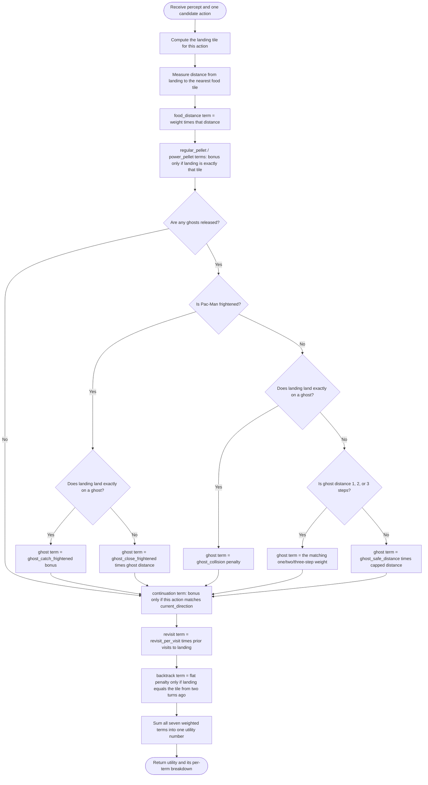
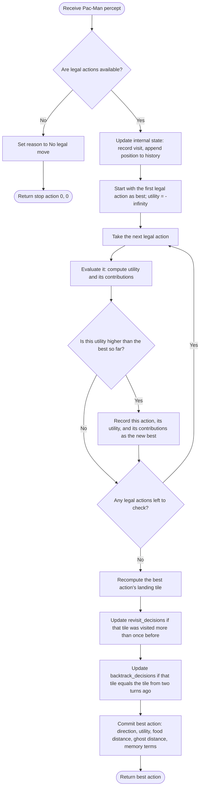

# AIMA Utility-Based Agent — Pac-Man Example

## Overview

This Pac-Man agent demonstrates the utility-based design discussed in **AIMA 4e, Figure 2.14**. It keeps everything Part 3 (model-based reflex) has — internal state built from the percept sequence — but replaces Part 3's condition-action *rules* with a single **utility function**: every legal action is scored on one numeric scale that blends several competing preferences (closer food is good, closer danger is bad, repetition is mildly bad, and so on), and the agent takes whichever action scores highest.

> [!important] The qualitative jump from Part 4
> A goal-based agent (Part 4) asks "does this satisfy the goal, or get me closer to it" — one criterion at a time, never blended. A utility-based agent asks "how good is this, all things considered," and can trade one desideratum off against another *inside a single number*. A tiny extra distance from food can be outweighed by a big improvement in ghost safety, or vice versa, depending on how the weights are tuned.

## Pac-Man percept

Same shape as Part 3 — `current_direction` is back (it feeds the `continuation` term below), unlike Part 4 which had no use for it.

| Field | Meaning |
|---|---|
| `player` | Pac-Man's current tile |
| `current_direction` | The direction Pac-Man is currently traveling |
| `pellets` | Set of tiles that still contain a regular pellet |
| `power_pellets` | Set of tiles that still contain a power pellet |
| `released_ghosts` | Tiles currently occupied by ghosts that are out and active |
| `legal_actions` | All movement directions currently available to Pac-Man |
| `frightened_time_remaining` | Seconds left in which ghosts are edible |
| `frightened` *(computed property)* | `True` whenever `frightened_time_remaining > 0.0` |

## Internal state (same fields as Part 3)

| Field | Type | What it tracks |
|---|---|---|
| `visit_counts` | `dict[tile, int]` | How many times Pac-Man has occupied each tile before now |
| `position_history` | `deque[tile]`, `maxlen=4` | The last up to four tiles occupied; `[-2]` is read as "two turns ago" the same way Part 3 reads it |
| `revisit_decisions` | `int` | Telemetry only — see the note below on how its threshold differs from Part 3 |
| `backtrack_decisions` | `int` | Telemetry only: incremented when the *chosen* action's landing tile equals the two-turns-ago tile |

> [!warning] The revisit threshold changed from Part 3
> Part 3 counted a "revisit decision" once the landing tile had been visited **at least once before** (`> 0`). This agent counts one only once the landing tile has been visited **at least twice before** (`> 1`) — one revisit is now tolerated silently in the telemetry, even though the `revisit` utility term below still applies a penalty starting from the very first repeat visit. Don't assume the two parts' revisit counters mean the same thing when comparing trial results.

## The utility function: `UtilityWeights`

This dataclass *is* the agent's utility function — a named, tunable weight for every feature the agent cares about. The code's own docstring makes a point of keeping this separate from the environment's performance measure (AIMA 4e Section 2.2 draws that same line; see `pacman/rules.py` for the actual scoring the game uses).

| Weight | Default | What it rewards / penalizes | Live by default? |
|---|---|---|---|
| `food_distance` | `-1.0` | Multiplied by steps to the nearest food; farther is worse | Yes |
| `regular_pellet` | `0.0` | Extra bonus for landing exactly on a regular pellet, on top of the distance term | No |
| `power_pellet` | `0.0` | Extra bonus for landing exactly on a power pellet | No |
| `ghost_catch_frightened` | `100.0` | Bonus for landing exactly on a frightened (edible) ghost | Yes |
| `ghost_close_frightened` | `0.0` | Multiplied by distance to a frightened ghost when *not* eating it this turn — see the callout below | No |
| `ghost_collision` | `-5000.0` | Penalty for landing exactly on a dangerous (non-frightened) ghost | Yes |
| `ghost_one_step` | `-30.0` | Penalty when the nearest dangerous ghost is exactly 1 step from the landing tile | Yes |
| `ghost_two_steps` | `0.0` | Penalty/bonus at exactly 2 steps | No |
| `ghost_three_steps` | `-2.0` | Small penalty at exactly 3 steps | Yes |
| `ghost_safe_distance` | `0.0` | Multiplied by a capped distance once 4+ steps from every ghost | No |
| `ghost_safe_distance_cap` | `0.0` | The cap used above — defaults to 0, so this term does nothing until both it and `ghost_safe_distance` are tuned together | No |
| `continuation` | `0.0` | Bonus for choosing the same direction Pac-Man is already heading — echoes Part 2's "keep going straight" rule, now optional | No |
| `revisit_per_visit` | `-0.5` | Multiplied by how many times the landing tile has been visited before | Yes |
| `backtrack` | `-0.5` | Flat penalty if the landing tile is the one occupied two turns ago | Yes |

> [!note] Half the dials are off by default
> Seven of the fourteen weights default to `0.0` — they're placeholders for you (or Part 6's training loop) to tune, not oversights. Out of the box, only `food_distance`, `ghost_catch_frightened`, `ghost_collision`, `ghost_one_step`, `ghost_three_steps`, `revisit_per_visit`, and `backtrack` actually influence behavior.

> [!note] Reading a weight that multiplies a distance
> Three weights get multiplied by a raw (or capped) distance rather than applied as a flat bonus, and the sign you need depends on which direction is "good": if **smaller** distance should be rewarded, the weight must be **negative** (`food_distance`, and `ghost_close_frightened` if you turn it on — chasing a frightened ghost means closer is better); if **larger** distance (up to a cap) should be rewarded, the weight must be **positive** (`ghost_safe_distance`, currently inert at `0.0`). It's easy to reach for a positive number when you want to reward something "attractive" — for a distance-scaled term that's backwards.
>
> Worked check: with `ghost_close_frightened = -2.0`, distance 1 gives `-2.0 × 1 = -2.0`; distance 5 gives `-2.0 × 5 = -10.0`. Since `-2.0 > -10.0`, the closer option scores higher — exactly the "closer is more attractive" behavior the field's default-value comment promises, but only once the weight is actually turned on.

## How ghost risk is bucketed

The ghost term is the only piece of `evaluate_action` with real branching. It only runs at all if there's at least one released ghost.

| Frightened? | Landing tile | Weight used |
|---|---|---|
| Yes | Exactly on a ghost | `ghost_catch_frightened` (flat bonus) |
| Yes | Not on a ghost | `ghost_close_frightened × distance` |
| No | Exactly on a ghost | `ghost_collision` (flat, huge penalty) |
| No | 1 step from nearest ghost | `ghost_one_step` (flat) |
| No | 2 steps from nearest ghost | `ghost_two_steps` (flat) |
| No | 3 steps from nearest ghost | `ghost_three_steps` (flat) |
| No | 4+ steps from every ghost | `ghost_safe_distance × min(distance, ghost_safe_distance_cap)` |

This mirrors Part 4's `DANGER_RADIUS` / `FLEE_SAFE_DISTANCE` idea (a near zone that matters, a cap beyond which extra distance stops helping) but expresses it as smoothly-tunable weights instead of a hard-coded threshold and tuple comparison.

> [!note] No empty-food guard here
> Part 4's `determine_goal` fell back to `{player}` when there were no pellets left, so `maze.distance` was never called against an empty set. `evaluate_action` has no equivalent fallback — if `pellets` and `power_pellets` are both empty, `self.maze.distance(landing, food)` is called with an empty `food`. What that returns depends on `MazeModel.distance`'s own contract, which is outside this file — worth checking if you ever see strange utility values very late in a level.

## A worked example

Assume the *unmodified default* weights, ghosts released, Pac-Man **not** frightened, and two candidate landing tiles:

|                           | Action A                 | Action B                |
| ------------------------- | ------------------------ | ----------------------- |
| Distance to nearest food  | 2                        | 4                       |
| Distance to nearest ghost | 1 (dangerous!)           | 6 (safe)                |
| Times visited before      | 0                        | 3                       |
| `food_distance` term      | `-1.0 × 2 = -2.0`        | `-1.0 × 4 = -4.0`       |
| `ghost` term              | `ghost_one_step = -30.0` | `min(6, 0) × 0.0 = 0.0` |
| `revisit` term            | `-0.5 × 0 = 0.0`         | `-0.5 × 3 = -1.5`       |
| `backtrack` term          | `0.0`                    | `0.0`                   |
| **Total utility**         | **-32.0**                | **-5.5**                |

Action B wins, even though it's farther from food *and* more heavily revisited — the single `-30.0` penalty for standing one step from a ghost dominates everything else in Action A's total. This is the whole point of a utility function: one bad-enough term can outweigh several mildly-good ones, and the agent never has to be told that explicitly — it falls out of the arithmetic.

## `evaluate_action` logic



## `choose_action` logic



## Equivalent pseudocode

```text
function EVALUATE-ACTION(percept, action):
    landing ← MAZE-STEP(percept.player, action)

    food ← pellets ∪ power_pellets
    food_distance ← DISTANCE(landing, food)
    ghosts ← released_ghosts
    ghost_distance ← DISTANCE(landing, ghosts) if ghosts else 10000

    terms.food_distance  ← w.food_distance * food_distance
    terms.regular_pellet ← w.regular_pellet if landing in pellets else 0
    terms.power_pellet   ← w.power_pellet if landing in power_pellets else 0

    ghost_term ← 0
    if ghosts:
        if frightened:
            if landing in ghosts:
                ghost_term ← w.ghost_catch_frightened
            else:
                ghost_term ← w.ghost_close_frightened * ghost_distance
        else:
            if landing in ghosts:
                ghost_term ← w.ghost_collision
            elif ghost_distance = 1:
                ghost_term ← w.ghost_one_step
            elif ghost_distance = 2:
                ghost_term ← w.ghost_two_steps
            elif ghost_distance = 3:
                ghost_term ← w.ghost_three_steps
            else:
                capped ← min(ghost_distance, w.ghost_safe_distance_cap)
                ghost_term ← w.ghost_safe_distance * capped
    terms.ghost ← ghost_term

    terms.continuation ← w.continuation if action = current_direction else 0

    revisit_count ← visit_counts.get(landing, 0)
    terms.revisit ← w.revisit_per_visit * revisit_count

    two_ago ← position_history[-2] if len(history) >= 2 else NONE
    terms.backtrack ← w.backtrack if landing = two_ago else 0

    utility ← SUM(terms.food_distance, terms.regular_pellet, terms.power_pellet,
                  terms.ghost, terms.continuation, terms.revisit, terms.backtrack)
    return utility, terms


function CHOOSE-ACTION(percept):
    if legal_actions is empty:
        return STOP

    UPDATE-STATE(percept)

    best ← legal_actions[0]
    best_utility ← -INFINITY

    for a in legal_actions:
        utility, terms ← EVALUATE-ACTION(percept, a)
        if utility > best_utility:
            best_utility ← utility
            best ← a

    return best
```

## Code responsibilities

| Component | Responsibility |
|---|---|
| `Percept` | Same world snapshot as Part 3 |
| `UtilityWeights` | The tunable utility function itself — one named weight per feature the agent can care about |
| `evaluate_action()` | Scores one candidate action: computes every weighted term plus a few raw diagnostic values, returns their sum and the full breakdown |
| `choose_action()` | Updates memory, evaluates every legal action, and returns whichever scored highest (ties keep the earliest action in `legal_actions` order) |
| `visit_counts`, `position_history` | Same internal state as Part 3, now feeding continuous penalties instead of hard filters |
| `revisit_decisions`, `backtrack_decisions` | Telemetry only — note the different revisit threshold from Part 3 |
| `last_reason` | Records the chosen direction, total utility, raw food/ghost distances, and the combined memory-term contribution |
