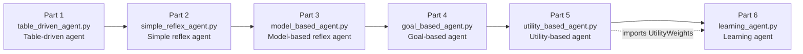
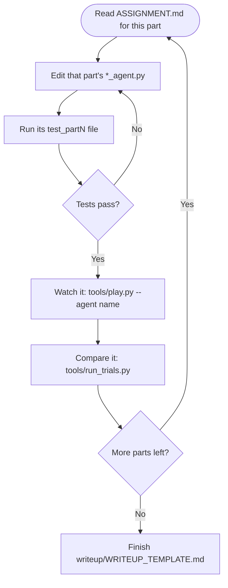

# COMP 469 — Chapter 2: Six Agents, One Chapter

## Overview

This assignment gives you one working Pac-Man game and six *broken* agents. You implement each one using AIMA 4e Chapter 2's agent taxonomy, **in this order**:

1. Table-driven agent
2. Simple reflex agent
3. Model-based reflex agent
4. Goal-based agent
5. Utility-based agent
6. Learning agent

The actual task-by-task instructions live in `ASSIGNMENT.md`; this note is the map of the repo and the commands you'll run, not a substitute for `ASSIGNMENT.md` or `RUBRIC.md`.

> [!note] Two things every agent is allowed to know
> Every agent gets exactly two sources of information: the **percept** it receives each turn, and the **static `MazeModel`** it was constructed with. Nothing else. If you find yourself reaching for extra game state, you're outside the assignment's rules.

## Setup

Requires Python 3.10+.

```bash
python3 -m venv .venv
source .venv/bin/activate          # Windows PowerShell: .venv\Scripts\Activate.ps1
python -m pip install -r requirements.txt
```

Pygame is only needed for the on-screen game window. The tests and the trial/training tools all work without it.

## Sanity check

```bash
python tools/play.py --agent table_driven
python tools/play.py --agent simple_reflex
python tools/play.py --agent greedy
```

You should see a maze, a yellow agent, and a status bar printing the agent's reasoning line by line.

`table_driven` and `simple_reflex` are unfinished starting code — they will not play well yet. `greedy` is a working external baseline for comparison; it is **not** a model answer for any of the six parts (see the comments at the top of `pacman/agents/greedy_baseline.py`).

Once a part is filled in, its play command becomes available:

```bash
python tools/play.py --agent model_based
python tools/play.py --agent goal_based
python tools/play.py --agent utility_based
python tools/play.py --agent learning
```

Controls: `SPACE` pause, `R` restart, `ESC` quit.

## The six parts and their dependency

Five of the six parts stand alone. The sixth does not: `learning_agent.py` imports `UtilityWeights` directly from `utility_based_agent.py` and constructs one with every field filled in, so **Part 5 must be finished before Part 6 will even import**.



The left-to-right order above is the assignment's intended teaching order (matching AIMA Chapter 2), not just a suggestion — Part 6 will not run at all until Part 5 exists.

## Suggested per-part workflow

Not mandated verbatim by the README, but the tools it gives you point at this loop:



## Running the tests

```bash
python -m unittest discover -s tests -v
```

Most will fail before you start — that's expected. Each test file matches one part: `test_part1_table_driven.py` checks `table_driven_agent.py`, and so on. `test_scope.py` and `test_trials_performance.py` check things that span all six agents. Treat the files under `tests/` as the spec — they define the contract each agent must satisfy.

## Running the trials

```bash
python tools/run_trials.py --count 30
```

Plays full episodes with no window for all six of your agents plus the `greedy` and `random` baselines, and prints a comparison table. Every agent sees the same seeds, so differences in the results come from the agents, not from luck.

## Training the learning agent

```bash
python tools/train_learning_agent.py --generations 80
```

Only meaningful once Part 6 is finished. Runs the problem-generator/critic loop from AIMA Figure 2.15, prints a before/after comparison, and saves `results/learned_weights.json`. After that, `tools/play.py --agent learning` and `tools/run_trials.py` pick up the trained weights automatically.

## Command quick reference

| Command | Purpose |
|---|---|
| `python tools/play.py --agent <name>` | Watch one agent play in the game window |
| `python -m unittest discover -s tests -v` | Run the full test suite (the spec) |
| `python tools/run_trials.py --count 30` | Headless comparison of all agents across identical seeds |
| `python tools/train_learning_agent.py --generations 80` | Train Part 6's weights (needs Part 5 done) |

## File map

| Path | What it is |
|---|---|
| `table_driven_agent.py` | **Part 1. Yours to edit.** |
| `simple_reflex_agent.py` | **Part 2. Yours to edit.** |
| `model_based_agent.py` | **Part 3. Yours to edit.** |
| `goal_based_agent.py` | **Part 4. Yours to edit.** |
| `utility_based_agent.py` | **Part 5. Yours to edit.** |
| `learning_agent.py` | **Part 6. Yours to edit.** Imports Part 5 directly. |
| `ASSIGNMENT.md` | The instructions, part by part. |
| `RUBRIC.md` | How this is graded. |
| `writeup/WRITEUP_TEMPLATE.md` | The written half of the assignment. |
| `tests/` | The contract. Read these; they are the spec. |
| `tools/play.py` | Watch an agent in a window. |
| `tools/run_trials.py` | Headless comparison across seeds. |
| `tools/train_learning_agent.py` | Trains Part 6. |
| `pacman/` | The task environment. Provided. Do not edit. |
| `results/` | Where your CSV and JSON output lands. |

## Rules

1. Edit only the six `*_agent.py` files — nothing else in the code.
2. Each agent gets exactly two sources of information: the percept it is handed each turn, and the static `MazeModel` it is constructed with. Nothing else.
3. Do not implement DFS, BFS, uniform-cost, greedy, or A\*. Maze distances are provided by `self.maze.distance` — search algorithms belong to Chapter 3, and this project is graded on agent *structure*, not search.
4. Do not add third-party dependencies.

> [!warning] If you're editing `pacman/`, stop
> Everything under `pacman/` is provided infrastructure. If you find yourself editing it to make a test pass, you're solving the wrong problem — the fix belongs in your agent, not the environment.

## Troubleshooting

| Symptom | Cause / fix |
|---|---|
| `ModuleNotFoundError: No module named 'pacman'` | Run commands from the project root, not from inside `tools/` or `tests/`. |
| `pygame` will not install | Skip it. `tools/run_trials.py`, `tools/train_learning_agent.py`, and the tests don't need it — you lose the window (a real loss for debugging, not for grading). |
| `ValueError: Percept declares field(s) [...] that this environment cannot sense` | You used a field name the environment doesn't have. The error message lists every valid name. |
| `TypeError: UtilityWeights.__init__() got an unexpected keyword argument ...` while loading `learning_agent.py` | Part 6 imports Part 5's `UtilityWeights` directly and constructs one with every field filled in — finish Part 5 (`TODO(CH2-5a)`) first. |
| The window opens but nothing moves | That agent's `choose_action` is probably returning `(0, 0)`, or raising an exception — check the terminal for a traceback. |
